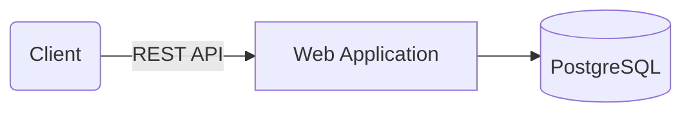
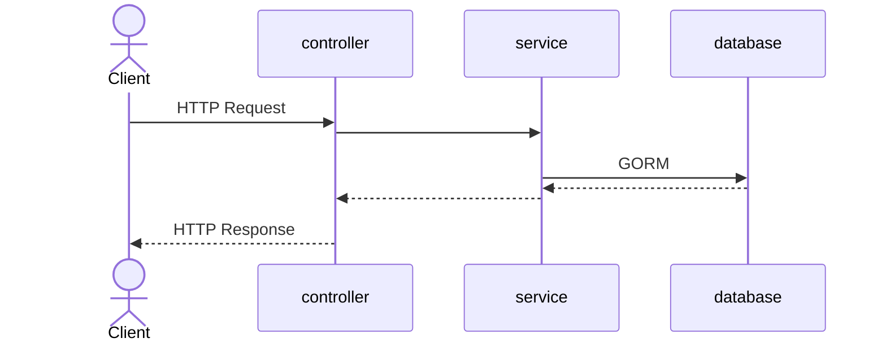

# URL Shortener

## Introduction

This is a URL shortening API written in Go. It supports the following high level requirements:

* Creating short urls with either a custom slug or random one
* Deleting short urls
* Getting simple statistics about short urls
* Accessing short urls

### Non-Goals

Notably, this project currently does not support the following:

* User management
* Authentication or Authorization

### High-Level Assumptions

One important part of the requirements that drives the design of this system is that the requirement calls for an _internal service for our company_. A few conclusions arise from this requirement:

1. The largest companies are millions of employees. We're not told how large "our company" in the requirements is, but let's assume that it's 1,000,000 employees. Furthermore, let's assume that 5% of employees create shorturls. Those employees each create 3 short URLs on average. That's **150,000** short URLs. This is by no means an application that needs to deal with a large volume of data.
2. Our application is going to be read heavy, relative to our write load.
3. We'll probably launch this on our internal company network; external users are not allowed.

The biggest takeaway I came to here was that building something simple will probably serve us well.

As an internal tool, I also decided to deprioritize user-specific functionality. The initial version of our application allows anyone to delete any short URL. For an initial launch of an internal tool, I think this is probably OK. Later on, we can integrate our employees if that's functionality we'd like to add.

## Running

The easiest way to run the application is to use `docker-compose`. You should run the following to get the application started:

```
docker compose build
docker compose up
```

or you can use the included `makefile`:

```
make docker-up
```

This will start the webserver on `localhost:8080` and you can begin to issue requests to the API.

## Routes

The application exposes the following routes:

| HTTP Verb     | Route               | Description |
| ------------- | --------------------| ----------- |
| `GET`         | `/:slug`            | Access a short URL. Clients are redirected to the long url associated with the given slug
| `POST`        | `/api/v1/shorturls` | Create a new short URL. Clients can specify their own custom slug or let the system generate a random one.
| `DELETE`      | `/api/v1/shorturls/:slug` | Delete the short URL associated with the given slug
| `GET`         | `/api/v1/shorturls/:slug` | Get short URL information associated with the given slug
| `GET`         | `/api/v1/shorturls/:slug/clicks` | Get analytics data associated with the given slug

## Architecture and Design

### High Level Overview



### Project Organization

```
├── controllers   # handle incoming requests
├── db            # database related code
├── e             # error handling
├── enums         # enumerated types
├── jobs          # scheduled tasks
├── middleware    # web server middleware
├── models        # business objects/entities
├── server        # web server startup
├── services      # service layer
├── test          # integration tests and test helpers
```

### Request Flow

API requests typically follow the following flow:



### Technology Choices

#### Go

Go is not my primary language. I develop mostly in Java and TypeScript. The prompt specifically calls out using Go as something that might get you extra credit. I went ahead and decided to do this in Go to demonstrate that I can pick up new languages and be productive quickly.

Here are the major Go libraries that this project uses:

| Project Name | Purpose               |
|--------------|-----------------------|
| GIN          | Web Framework         |
| GORM         | Data access layer/ORM |
| Testify      | Testing               |

##### Downsides and Alternatives Considered

As stated above, the big downside of doing this in Go was my unfamiliarity with the language. I also considered completing this in:

* **Java/Spring Boot**: Lots of automatic support for building APIs quickly.
* **TypeScript/Express**: Relatively easy to setup, plus I'm familiar with the ecosystem.

#### Docker

Docker (and Docker Compose) allow easily spinning up a local environment with a coordinated web application and Postgres database. Lots of modern infrastructure also supports deploying docker containers, so building this in docker allows me to theoretically deploy this somewhere pretty easily.

#### Postgres

The backing database for the application is Postgres. I chose Postgres because I'm very familiar with it, and it's a reasonable default for most new projects. Postgres met the following requirements outlined in the specification:

* **No duplicate URLs are allowed to be created.** This is handled using unique constraints within Postgres.
* **Data persistence (must survive computer restarts)**. Since Postgres features ACID properties, the _Durability_ property ensures that data remains committed even in the event of a system failure or restart.

Postgres is also widely supported by open source ORMs and other database tooling.

##### Downsides and Alternatives Considered

I considered the following other database technologies:

* **Redis**: Simple key/value store that does support some measure of durability. However, relational databases like Postgres provide stronger ACID guarantees.
* **ClickHouse**: Postgres isn't really meant for storing analytical data. I considered using ClickHouse to store short url accesses. However, I abandoned this idea in favor of keeping the architecture simple. We can use a separate analytics database later on if we need to scale in that direction.
* **SQLite**: SQLite is an excellent self-contained database that would have worked fine in this application. However, the extra overhead of getting Postgres running in a docker container was minimal compared to getting SQLite working. That said, I think this would have been a fine choice as well.

As mentioned in the "ClickHouse" note, the main part of the requirements that Postgres (or any relational database) may not handle well is the analytics piece. If our URL shortener service gets lots of use, we will have a huge `clicks` table and we'll clearly have to come up with solutions to scale that part of the architecture.


