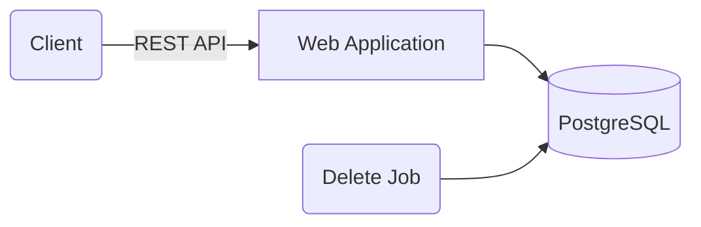
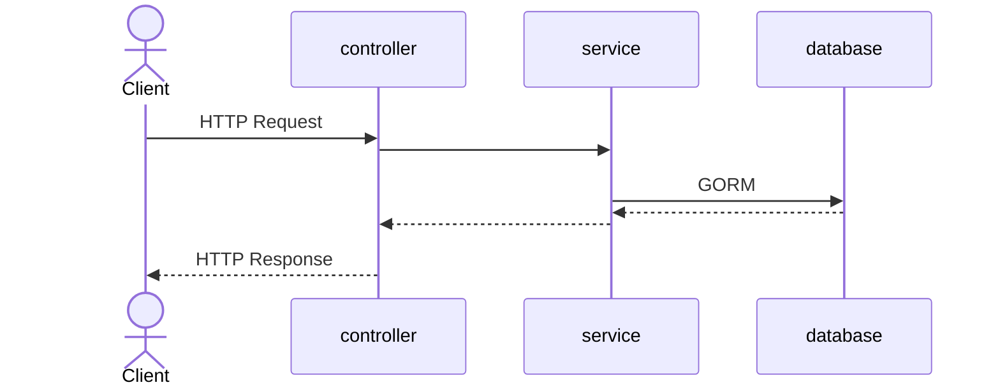

# URL Shortener

## Introduction

This is a URL shortening API written in Go. It supports the following high level requirements:

* Creating short urls with either a custom slug or random one
* Deleting short urls
* Getting simple statistics about short urls
* Accessing short urls

### Non-Goals

Notably, this project currently does not support the following:

* User management
* Authentication or Authorization

## Running

### Requirements

Running the project requires:

* Docker v20.10.14
* Docker Compose v2.4.1
* Go 1.18.1

### Getting Started

#### Option 1: Docker

The easiest way to run the application is to use `docker-compose`. You should run the following to get the application started:

```
docker compose build
docker compose up
```

or you can use the included `makefile`:

```
make docker-up # builds the docker container and runs it
```

This will start the webserver on `localhost:8080` and you can begin to issue requests to the API.

#### Option 2: Locally

Assuming your machine has everything required, you should be able to run:

```
make build      # build the application
make test       # run all tests
make test-short # run only unit tests
```

If you want to run the application locally, you'll need to spin up a test database. The easiest way to do this is using `docker compose`:

```
docker compose up -d db
```

This will start a database in the background. The values in the `.env` file should work for this database, but remember to change those values if you have some other Postgres running.

## Routes

The application exposes the following routes:

| HTTP Verb     | Route                            | Description|
| ------------- | ---------------------------------| ---------- |
| `GET`         | `/:slug`                         | Access a short URL. Clients are redirected to the long url associated with the given slug
| `POST`        | `/api/v1/shorturls`              | Create a new short URL. Clients can specify their own custom slug or let the system generate a random one.
| `GET`         | `/api/v1/shorturls`              | List all short URLs in the system.
| `DELETE`      | `/api/v1/shorturls/:slug`        | Delete the short URL associated with the given slug
| `GET`         | `/api/v1/shorturls/:slug`        | Get short URL information associated with the given slug
| `GET`         | `/api/v1/shorturls/:slug/clicks` | Get analytics data associated with the given slug

Finally, there's a route that exposes Swagger documentation at `/swagger/index.html` (so `http://localhost:8080/swagger/index.html` if you're running this on the default port)

## Architecture and Design

### High-Level Assumptions

One important part of the requirements that drives the design of this system is that the requirement calls for an _internal service for our company_. A few conclusions arise from this requirement:

1. The largest companies are millions of employees. We're not told how large "our company" in the requirements is, but let's assume that it's 1,000,000 employees. Furthermore, let's assume that 5% of employees create shorturls. Those employees each create 3 short URLs on average. That's **150,000** short URLs. This is by no means an application that needs to deal with a large volume of data (except for maybe analytics, which I discuss later).
2. Our application is going to be read heavy, relative to our write load.
3. We'll probably launch this on our internal company network; external users are not allowed.

The biggest takeaway I came to here was that building something simple will probably serve us well.

As an internal tool, I also decided to deprioritize user-specific functionality. The initial version of our application allows anyone to delete any short URL. For an initial launch of an internal tool, I think this is probably OK. Later on, we can integrate our employees if that's functionality we'd like to add.


### High Level Overview



### Project Organization

```
├── controllers   # handle incoming requests
├── db            # database related code
├── docs          # swagger artifacts
├── e             # error handling
├── enums         # enumerated types
├── env           # environment variable related code
├── jobs          # scheduled tasks
├── middleware    # web server middleware
├── models        # business objects/entities
├── server        # web server startup
├── services      # service layer
├── test          # integration tests and test helpers
```

### Request Flow

API requests typically follow the following flow:



### Cleanup Job

One of the requirements was that the short URLs have an optional expiration date. To accomplish this, I've included a very simple scheduled job that sweeps the database every 5 seconds for expired links.

### Technology Choices

#### Go

Go is not my primary language. I develop mostly in Java and TypeScript. The prompt specifically calls out using Go as something that might get you extra credit. I went ahead and decided to do this in Go to demonstrate that I can pick up new languages and be productive quickly.

Here are the major Go libraries that this project uses:

| Project Name | Purpose               |
|--------------|-----------------------|
| GIN          | Web Framework         |
| GORM         | Data access layer/ORM |
| Testify      | Testing               |
| gocron       | Scheduled Tasks       |
| nanoid       | Slug generation       |

##### Downsides and Alternatives Considered

As stated above, the big downside of doing this in Go was my unfamiliarity with the language. I also considered completing this in:

* **Java/Spring Boot**: Lots of automatic support for building APIs quickly.
* **TypeScript/Express**: Relatively easy to setup, plus I'm familiar with the ecosystem.

#### Docker

Docker (and Docker Compose) allow easily spinning up a local environment with a coordinated web application and Postgres database. Lots of modern infrastructure also supports deploying docker containers, so building this in docker allows me to theoretically deploy this somewhere pretty easily.

#### Postgres

The backing database for the application is Postgres. I chose Postgres because I'm very familiar with it, and it's a reasonable default for most new projects. Postgres met the following requirements outlined in the specification:

* **No duplicate URLs are allowed to be created.** This is handled using unique constraints within Postgres.
* **Data persistence (must survive computer restarts)**. Since Postgres features ACID properties, the _Durability_ property ensures that data remains committed even in the event of a system failure or restart.

Postgres is also widely supported by open source ORMs and other database tooling.

##### A note on GORM & `AutoMigrate`

I wouldn't ever use something like `AutoMigrate` in a "real" application. Database migrations need to be carefully and deliberately applied, typically with a schema evolution process that exists outside of your application startup.

##### Downsides and Alternatives Considered

I considered the following other database technologies:

* **Redis**: Simple key/value store that does support some measure of durability. However, relational databases like Postgres provide stronger ACID guarantees.
* **ClickHouse**: Postgres isn't really meant for storing analytical data. I considered using ClickHouse to store short url accesses. However, I abandoned this idea in favor of keeping the architecture simple. We can use a separate analytics database later on if we need to scale in that direction.
* **SQLite**: SQLite is an excellent self-contained database that would have worked fine in this application. However, the extra overhead of getting Postgres running in a docker container was minimal compared to getting SQLite working. That said, I think this would have been a fine choice as well.

As mentioned in the "ClickHouse" note, the main part of the requirements that Postgres (or any relational database) may not handle well is the analytics piece. If our URL shortener service gets lots of use, we will have a huge `clicks` table and we'll clearly have to come up with solutions to scale that part of the architecture.

#### REST vs GraphQL vs ...

I chose REST because our current requirements don't call for a rich domain with lots of interrelated or hierarchical objects. I think a simple REST API was a better fit for this project.

### Short URL Mechanics

#### Database Schema

```
                                       Table "public.short_urls"
   Column   |           Type           | Collation | Nullable |                Default                 
------------+--------------------------+-----------+----------+----------------------------------------
 id         | bigint                   |           | not null | nextval('short_urls_id_seq'::regclass)
 long_url   | text                     |           | not null | 
 created_at | timestamp with time zone |           |          | now()
 expires_on | timestamp with time zone |           |          | 
 slug       | text                     |           | not null | 
Indexes:
    "short_urls_pkey" PRIMARY KEY, btree (id)
    "uq_short_urls_long_url" UNIQUE, btree (long_url)
    "uq_short_urls_slug" UNIQUE, btree (slug)
Referenced by:
    TABLE "clicks" CONSTRAINT "fk_short_urls_clicks" FOREIGN KEY (short_url_id) REFERENCES short_urls(id) ON DELETE CASCADE
```

#### Creation

Users can specify their own "slug" or the system will generate one. I chose to use [nanoid](https://github.com/ai/nanoid) (specifically [go-nanoid](https://github.com/matoous/go-nanoid)) to generate URL-friendly slugs. Currently, slugs are configured to be 8 characters long, and they use `[A-Za-z0-9]` as an input alphabet for nanoid generation. With these settings, we _could_ run into collisions eventually, but it would be easy to regenerate slugs that would be duplicates.

Only URLs with `http` and `https` schemes are allowed.

Here are some other rules about short URL creation:

* **Long URLs _and_ short URLs must be unique in the database**. A unique constraint on the `short_urls` table prevents duplicates from being inserted.
* **Users receive a `409 CONFLICT` if a duplicate slug is specified**. Since duplicate slugs will be a result of user specification, it felt more correct to give them an error message than to return the short URL currently using that slug.
* **Users receive a `200 OK` with the slug currently being used for the long URL if a duplicate long URL is specified**. Users attempting to shorten a URL that's already been shortened will receive the existing short URL.

#### Deletion

Currently, anyone can delete any short url (see "non-goals" above). Short URLs can also be deleted if their expiration date has passed. When a short URL is deleted, all statistics are also deleted.

#### Updates

Short URLs are immutable and updates are not allowed.

#### Access

##### Status Code

I considered the following four status codes (which would all perform redirects):

* `301 MOVED PERMANENTLY`
* `302 FOUND`
* `303 SEE OTHER`
* `307 TEMPORARY REDIRECT`

After some research, I believe `302`, `303`, and `307` are in the same family of temporary redirects. Any of these might work fine, but I found `301 MOVED PERMANENTLY` to best represent the function of a URL shortener. With that status we're signaling "this URL will permanently redirect to this other URL."

##### `Cache-Control` 

If you allow browsers (or others) to cache the response, your server might not get hit for every access. This leads to an interesting trade off between accuracy of your statistics and cacheability. For this service, I chose accurate statistics. Using this handy [cache flowchart](https://web.dev/http-cache/#flowchart), I chose `no-cache`. This means that the response is reusable, but it must be revalidated with the server. This appears to work in modern versions of both Firefox and Chrome.

I did notice that commercial URL shorteners use different `Cache-Control` header values (along with `max-age`).

#### `Location`

In order to perform the redirect properly, you must set the `Location` header. This is done by populating the header value with the `LongUrl` we have on file for the requested slug


#### Statistics (clicks)

Every time a short URL is accessed, a new row gets inserted into the `clicks` table:

```
    Column    |           Type           | Collation | Nullable |              Default
--------------+--------------------------+-----------+----------+------------------------------------
 id           | bigint                   |           | not null | nextval('clicks_id_seq'::regclass)
 short_url_id | bigint                   |           |          |
 created_at   | timestamp with time zone |           |          |
Indexes:
    "clicks_pkey" PRIMARY KEY, btree (id)
    "idx_clicks_created_at" btree (created_at)
Foreign-key constraints:
    "fk_short_urls_clicks" FOREIGN KEY (short_url_id) REFERENCES short_urls(id) ON DELETE CASCADE

```

When users request statistics, this table is simply queried with the appropriate date thresholds, and then rows are counted.

Ideas for scaling this include:
* A scheduled task that aggregates statistics every so often (the `clicks` table could get large fast)
* Using a database that's actually built for analytics instead of Postgres

## Things I didn't quite get to

* **End-User Experience**: I began work on a ReactJS frontend (see the `frontend` branch in this repository), but I ran out of time.
* **Observability**: This was lower on my priority list since it was listed as "optional" in the requirements
* **Real Deployment**: It would have been nice to get this deployed somewhere like Heroku

## Development Philosophies

### Testing

For this project I wrote high level tests (in `test/integration`) that use a real database and real web server. I typically did this before any implementation. This allowed me to constantly refactor underneath those tests. I did not write many unit tests since the application isn't very complex, and I prefer to avoid mocking where possible. The integration tests run fast enough and do a good job covering most cases.

### Git Workflow

While it might not look like it, I did _not_ just commit to `main` through the duration of development. I like to use `git merge <branch> --ff-only` to create a linear history and avoid merge commits.

